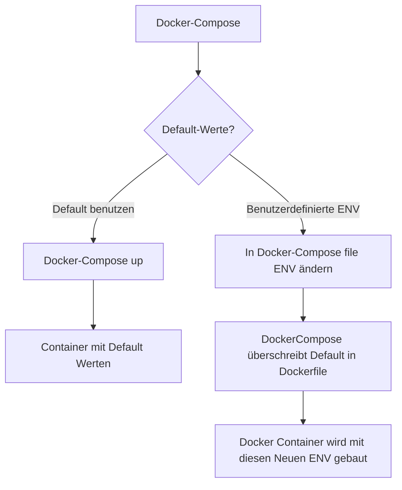

# RestService
## Java-Gradle-SpringBoot-Rest Schnittstelle

Mit Hilfe dieser Rest Schnittstelle ermöglichen wir es uns über eine API Schnittstelle
mit der Datenbank zu Kommunzieren.

### Die API Doku ist über Swagger einsehbar 
Link: localhost:8080/swagger-ui.html/

### Docker Container
Mit Hilfe der Dockerfile wird dieses Gradle Projekt zusammen mit einem Docker Datenbank aufgebaut und im Internen Netz verknüpft.

#### Container Variablen

Die Variablen sind bereits im Container Image vorbelegt (siehe Tabelle) und können in der docker-compose.yml überschrieben werden. Die Standard Variablen im Dockerfile sollten überschrieben werden mit Username=dev und Password=dev da ansonsten die default werte genommen

| Variable        | Default  | Beschreibung                                                                       |
| --------------- | -------- | ---------------------------------------------------------------------------------- |
| BACKEND_DB_HOST | database | IP oder FQDN des Datenbankservers (Bsp.: localhost oder database.mycompany.int)    |
| BACKEND_DB_PORT | 5432     | Port unter welchem die Datenbank läuft (im Internen Docker virtuellen Docker Netz) |
| BACKEND_DB_USER | -keine-  | Nutzername unter welchem man auf die laufende Datenbank zugreift                   |
| BACKEND_DB_PASS | -keine-  | Zugehörige Passwort zum Nutzernamen der Datenbank                                  |

